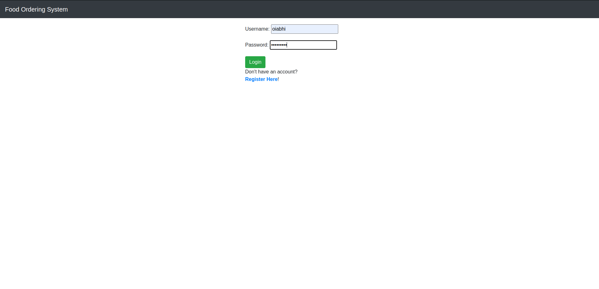
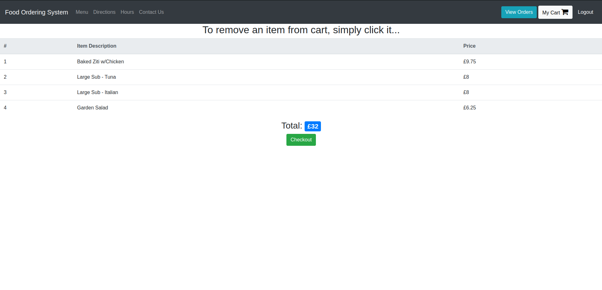

# 🍽️ Food Ordering System

An online food ordering web application built with Django. This project allows users to log in, register an account, and order food from a categorized menu. Users can view and interact with the menu, add items to their cart, and manage their orders. The app is designed with a focus on UI/UX to enhance the user experience.

---

## Features

- **User Authentication**: Login to an existing account or register a new account.
- **Food Menu**: View and order food items from categories like Main Course, Beverages, and Salad.
- **Shopping Cart**: Users can add items to their cart and review the order before checkout.
- **View Orders**: Users can view their current orders.
- **Admin Panel**: Admin can manage menu items, categories, and orders.
- **Responsive Design**: The app is optimized for both desktop and mobile views.

---

## 🛠️ Technologies Used

- **Backend**: Django (Python)
- **Frontend**: HTML, CSS, JavaScript
- **Database**: SQLite (default) or PostgreSQL (optional for production)
- **User Authentication**: Django's built-in authentication system

---

## 🚀 Getting Started

### Prerequisites

- Python 3.8+ installed
- Virtualenv (optional but recommended)
- Git installed on your system

---

### Installation

1. **Clone the Repository**
   ```bash
   git clone https://github.com/your-username/your-repo-name.git
   cd your-repo-name
   ```

2. **Set Up a Virtual Environment**
   ```bash
   python -m venv venv
   source venv/bin/activate  # On Windows: venv\Scripts\activate
   ```

3. **Install Dependencies**
   ```bash
   pip install -r requirements.txt
   ```

4. **Set Up the Database**
   ```bash
   python manage.py makemigrations
   python manage.py migrate
   ```

5. **Create a Superuser (for Admin Panel)**
   ```bash
   python manage.py createsuperuser
   ```

6. **Run the Server**
   ```bash
   python manage.py runserver
   ```

7. **Access the Application**
   - Open [http://127.0.0.1:8000/](http://127.0.0.1:8000/) in your browser.
   - Admin panel: [http://127.0.0.1:8000/admin/](http://127.0.0.1:8000/admin/)

---

## ✨ Usage Instructions

1. **Login/Sign Up**: 
   - Register a new account or log in using your existing credentials.
   
2. **Browse the Menu**:
   - The food items are categorized into **Main Course**, **Beverages**, and **Salad**.
   - Click the "Order" button to add items to your cart.
   
3. **Like/Dislike Items**:
   - Like or dislike food items to help with future recommendations.
   
4. **View Cart**:
   - You can view your cart from the top right corner, where you can check the items you’ve added.

5. **Logout**: 
   - Logout by clicking the "Logout" button in the top-right corner.

---

## 📦 Development

### Adding New Features

1. **Create a New Branch**
   ```bash
   git checkout -b feature/your-feature-name
   ```

2. **Make Changes**
   - Edit the necessary files, whether it's models, views, templates, or static assets.

3. **Push Changes**
   ```bash
   git add .
   git commit -m "Add feature: your-feature-name"
   git push origin feature/your-feature-name
   ```

4. **Open a Pull Request** on GitHub.

---

## 📦 Deployment

- **Frontend**: The frontend can be deployed on platforms like Vercel (if you use React or static assets for frontend) or any other platform like Netlify.
- **Backend**: Django backend can be deployed on platforms like Heroku, Render, or Railway.

---

## 📝 License

This project is licensed under the MIT License. See the [LICENSE](LICENSE) file for details.

---

## 📧 Contact

For any queries or suggestions, feel free to reach out:
- **Email**: frabhinav709@gmail.com
- **GitHub**: [frabhinav](https://github.com/your-frabhinav)

---

## 🌟 Acknowledgments

Special thanks to the Django community and all the open-source contributors for their invaluable tools and support.

---

### Screenshots

Below are some screenshots of the app's interface:

1. **Login Page**:
   

2. **Food Menu**:
   

3. **Cart Page**:
   

